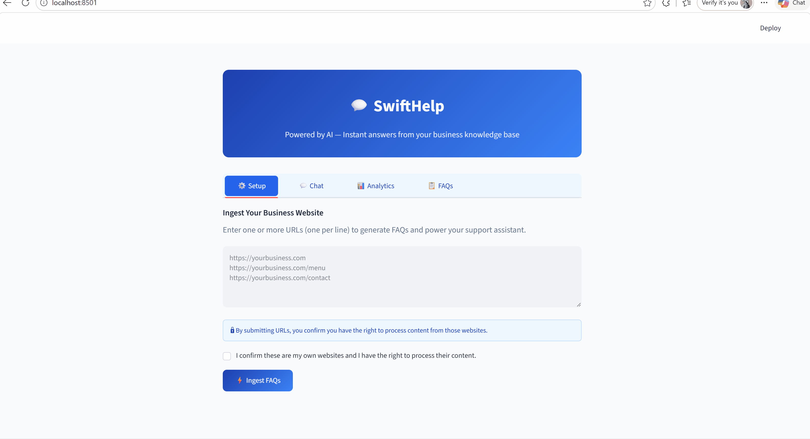

# 💬 SwiftHelp — AI-Powered Customer Support Chatbot

SwiftHelp is an end-to-end customer support chatbot that automatically generates FAQs from any business website and answers customer questions using Retrieval-Augmented Generation (RAG). Built with LangGraph, LangChain, ChromaDB, and OpenAI.



---

## Architecture

```
┌─────────────────────────────────────────────────────────┐
│                  Graph 1: Ingestion Pipeline             │
│                                                          │
│  URL → Scrape → Extract → Clean → Chunk → Generate FAQs │
│      → Validate → Embed → Store in ChromaDB              │
└─────────────────────────────────────────────────────────┘
                          │
                     ChromaDB (FAQs)
                          │
┌─────────────────────────────────────────────────────────┐
│                  Graph 2: Support Pipeline               │
│                                                          │
│  User Query → Classify Intent                            │
│      ├── escalate → Escalation Node → Email + Ticket     │
│      └── faq/other → Load Memory → Retrieve Context      │
│                    → Generate Answer → Save Memory       │
│                    → Finalize Response                   │
└─────────────────────────────────────────────────────────┘
```

---

## Features

- **Multi-URL Ingestion** — scrape multiple pages from any business website
- **RAG-based Q&A** — answers grounded in real website content
- **Intent Classification** — routes faq, escalation, and general messages
- **Escalation + Email** — raises support tickets and sends email notifications
- **Streaming Responses** — LLM types word-by-word for a professional UX
- **Multi-language Support** — detects and replies in the user's language
- **Session Memory** — maintains conversation context across turns
- **Analytics Dashboard** — FAQ count, sessions, topic breakdown chart
- **FAQ Management** — view, search, and delete stored FAQs
- **Feedback Buttons** — 👍 👎 on each answer, saved to feedback.json
- **Export FAQs** — download all stored FAQs as CSV
- **FastAPI Endpoint** — expose the chatbot as a REST API
- **LangSmith Tracing** — full observability of every LangGraph run
- **Docker** — containerized with docker-compose

---

## Tech Stack

| Layer | Technology |
|---|---|
| Orchestration | LangGraph |
| LLM | OpenAI gpt-4o-mini |
| Embeddings | OpenAI text-embedding-3-small |
| Vector Store | ChromaDB |
| Web Scraping | BeautifulSoup + requests |
| Frontend | Streamlit |
| Backend API | FastAPI |
| Observability | LangSmith |
| Containerization | Docker + docker-compose |

---

## Project Structure

```
Customer_Support(FAQs)/
├── Chatbot_Backend.py    # LangGraph pipelines (ingestion + support)
├── Chatbot_Frontend.py   # Streamlit UI (4 tabs)
├── Chatbot_run.py        # FastAPI endpoints + one-click launcher
├── requirements.txt      # Python dependencies
├── Dockerfile
├── docker-compose.yml
├── .dockerignore
├── .env                  # API keys (not committed)
└── test_site.html        # Sample website for testing
```

---

## Setup

### 1. Clone the repository
```bash
git clone https://github.com/yourusername/swifthelp.git
cd swifthelp
```

### 2. Create a virtual environment
```bash
python -m venv venv
venv\Scripts\activate      # Windows
source venv/bin/activate   # Mac/Linux
```

### 3. Install dependencies
```bash
pip install -r requirements.txt
```

### 4. Configure environment variables
Create a `.env` file:
```
OPENAI_API_KEY=your_openai_api_key
LANGCHAIN_API_KEY=your_langsmith_api_key
LANGCHAIN_PROJECT=SwiftHelp
LANGCHAIN_TRACING_V2=true
SUPPORT_EMAIL=your@email.com
SMTP_SENDER_EMAIL=your@gmail.com
SMTP_APP_PASSWORD=your_gmail_app_password
```

---

## Running the App

### Option 1 — One click (Streamlit + FastAPI together)
```bash
python Chatbot_run.py
```

### Option 2 — Separately
```bash
# Frontend only
streamlit run Chatbot_Frontend.py

# Backend API only
uvicorn Chatbot_run:app --port 8000
```

### Option 3 — Docker
```bash
docker-compose up --build
```

| Service | URL |
|---|---|
| Streamlit UI | http://localhost:8501 |
| FastAPI Docs | http://localhost:8000/docs |

---

## API Endpoints

### `POST /ingest`
Scrape one or more URLs and store FAQs in ChromaDB.

```json
{
  "urls": ["https://yourbusiness.com", "https://yourbusiness.com/menu"]
}
```

### `POST /chat`
Ask a question and get an answer.

```json
{
  "query": "What are your opening hours?",
  "session_id": "abc123"
}
```

---

## How It Works

1. **Business owner** pastes their website URL in the Setup tab
2. LangGraph **scrapes, cleans, chunks** the page content
3. **gpt-4o-mini** generates FAQ pairs from each chunk
4. FAQs are **embedded and stored** in ChromaDB
5. **Customer** asks a question in the Chat tab
6. Intent is **classified** — faq, escalate, or other
7. Relevant FAQs are **retrieved** via semantic search
8. **gpt-4o-mini** generates a grounded answer
9. Conversation is **saved** for context in follow-up questions

---

## LangSmith Tracing

Every pipeline run is traced automatically. View at [smith.langchain.com](https://smith.langchain.com) under your project name.

---

## License

MIT License — free to use and modify.
